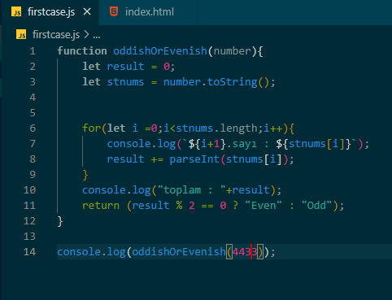

**oddishOrEvenish() isimli bu fonksiyon kendisine verilen sayının basamaklarının toplamını bulup sonuca göre o sayının tek sayı veya çift sayı olduğunu söyler** 
   

**Örnek olarak 4433 sayısını gönderelim -> oddishOrEvenish(4433)** 

