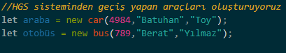
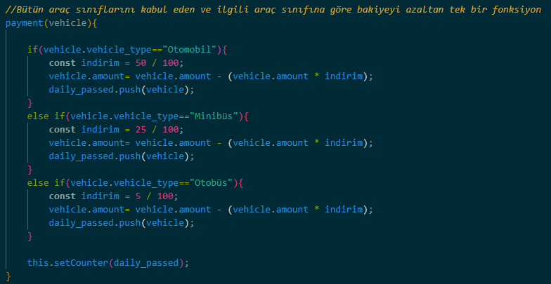
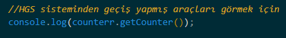
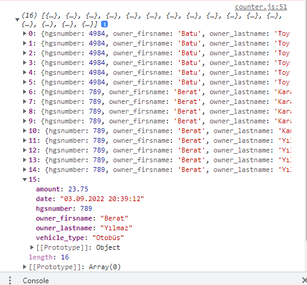
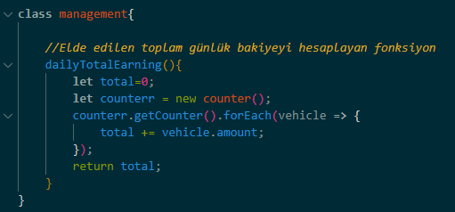
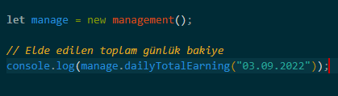
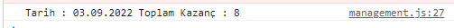

**HGS sisteminden geçen araca göre yeni class oluşturuyoruz**

**HGS sisteminden geçen araca, sınıfına göre ücretlendirme yapan ve günlük olarak geçen araçların kayıt edildiği diziye ekleen fonksiyon**

**payment fonksiyonumuza "otobüs" isimli aracı gönderiyoruz**

**HGS sisteminen o gün geçmiş olan araçları görmek için counter sınıfında tanımlı getCounter() isimli fonksiyonu çağırıyoruz**

**management sınıfında tanımlı günlük kazancı hesaplayan dailyTotalEarning() isimli fonksiyon**

**Elde edilen günlük bakiyeyi ögrenmek için dailyTotalEarning() fonksiyonuna kazancını öğrenmek istediğimiz tarihi veriyoruz**

