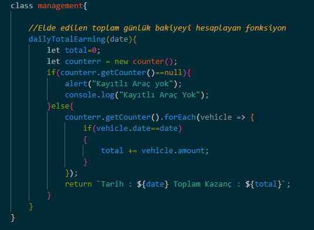

**HGS sisteminden geçen araca göre yeni class oluşturuyoruz** 
   

**HGS sisteminden geçen araca, sınıfına göre ücretlendirme yapan ve günlük olarak geçen araçların kayıt edildiği diziye ekleen fonksiyon** 
   

**payment fonksiyonumuza "otobüs" isimli aracı gönderiyoruz** 
   

**HGS sisteminen o gün geçmiş olan araçları görmek için counter sınıfında tanımlı getCounter() isimli fonksiyonu çağırıyoruz** 
 
   

**management sınıfında tanımlı günlük kazancı hesaplayan dailyTotalEarning() isimli fonksiyon** 
   

**Elde edilen günlük bakiyeyi ögrenmek için dailyTotalEarning() fonksiyonuna kazancını öğrenmek istediğimiz tarihi veriyoruz** 
 

